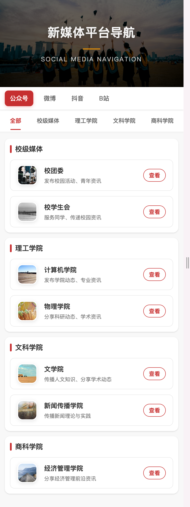
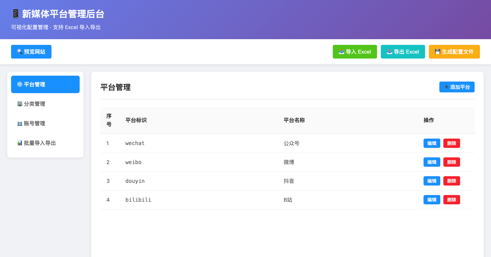
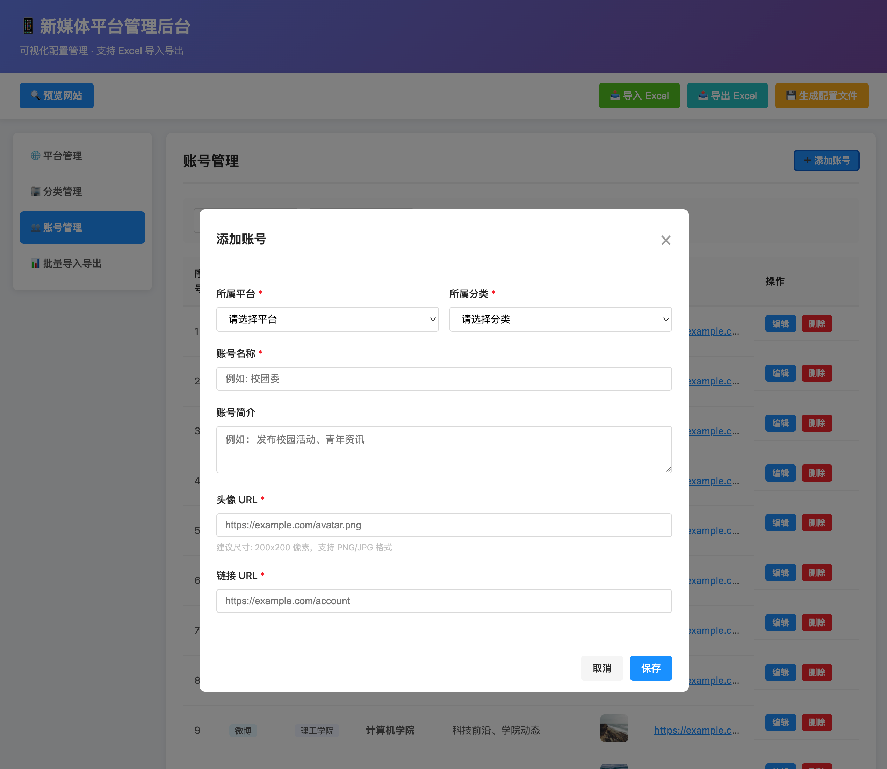

# 校园新媒体平台导航

一个优雅的校园新媒体平台导航网站，帮助学生快速找到并关注各个学院和部门的官方社交媒体账号。

## 📸 效果预览

<div align="center">
  
  
  
</div>

<p align="center">
  <em>首页展示 · 后台首页 · 添加平台</em>
</p>

## 功能特点

### 前台展示
- 🎯 多平台聚合：整合微信公众号、微博、抖音、B站等多个平台
- 🏢 分类展示：按照校级媒体、学院分类等多维度组织展示
- 🎨 优雅界面：采用现代化设计，提供流畅的用户体验
- 📱 响应式布局：完美适配电脑、平板和手机等各类设备
- ⚡ 轻量快速：无需后端，纯静态部署，加载迅速

### 后台管理（⭐ 新增）
- 🎨 **可视化管理界面**：无需编写代码，像填表单一样简单
- 📊 **Excel 批量导入导出**：支持 Excel/WPS，批量编辑更高效
- 🔄 **一键生成配置**：自动生成配置文件，无需手写代码
- ✅ **数据验证**：自动检查数据格式，避免错误
- 👥 **适合非技术人员**：技术小白也能轻松维护更新

## 项目结构 
```
├── index.html          # 前台展示页面
├── admin.html          # 后台管理页面 ⭐
├── README.md           # 项目说明文档
├── docs/               # 📁 文档目录 ⭐
│   ├── QUICK_START.md      # 5分钟快速上手指南
│   ├── ADMIN_GUIDE.md      # 管理后台详细使用指南
│   └── EXCEL_TEMPLATE.md   # Excel 模板格式说明
├── css/
│   ├── style.css       # 前台样式
│   └── admin.css       # 后台样式 ⭐
├── js/
│   ├── config.js       # 配置文件
│   ├── main.js         # 前台逻辑
│   └── admin.js        # 后台逻辑 ⭐
└── image.png           # 预览图片
```

## 快速开始

### 方式一：使用管理后台（推荐 ⭐）

**适合：技术小白、需要频繁更新数据**

1. **打开管理后台**
   ```bash
   # 直接在浏览器中打开
   open admin.html
   ```

2. **可视化编辑数据**
   - 点击【平台管理】添加社交媒体平台
   - 点击【分类管理】添加学院分类
   - 点击【账号管理】添加具体账号

3. **生成配置文件**
   - 点击【💾 生成配置文件】
   - 下载 `config.js` 文件
   - 替换项目中的 `js/config.js`

4. **查看效果**
   - 打开 `index.html` 预览网站
   - 部署到服务器

📚 **[查看完整文档中心](docs/README.md)**

📖 **5分钟上手**: [快速开始指南](docs/QUICK_START.md)  
📖 **详细教程**: [管理后台使用指南](docs/ADMIN_GUIDE.md)  
📖 **Excel格式**: [Excel 模板说明](docs/EXCEL_TEMPLATE.md)

### 方式二：使用 Excel 批量编辑

**适合：批量导入、数据迁移**

1. **导出模板**
   - 打开 `admin.html`
   - 点击【📤 导出 Excel】

2. **编辑 Excel**
   - 使用 Excel/WPS 打开文件
   - 按照表格格式编辑数据
   - 包含三个工作表：平台配置、分类配置、账号配置

3. **导入数据**
   - 点击【📥 导入 Excel】
   - 选择编辑好的文件

4. **生成配置**
   - 点击【💾 生成配置文件】
   - 替换 `js/config.js`

### 方式三：直接编辑代码（传统方式）

**适合：技术人员、一次性配置**

1. **克隆或下载项目文件**
2. **修改 `js/config.js` 配置文件**
3. **部署到任意 Web 服务器**

## 配置说明

### 使用管理后台配置（推荐）

打开 `admin.html` 即可通过可视化界面管理所有配置，无需手写代码。

详细说明请查看：[管理后台使用指南](ADMIN_GUIDE.md)

### 手动编辑配置文件

<details>
<summary>点击展开手动配置说明</summary>

#### 1. 新增平台
在 `config.js` 中的 `pingtai` 数组添加新平台：
```javascript
{
    pingtai: 'xiaohongshu',  // 平台唯一标识
    mingcheng: '小红书'       // 平台显示名称
}
```

#### 2. 新增分类
在 `config.js` 中的 `fenlei` 数组添加新分类：
```javascript
{
    biaoshi: 'yishu',        // 分类唯一标识
    mingcheng: '艺术学院'    // 分类显示名称
}
```

#### 3. 新增账号
在 `config.js` 中的 `zhanghao` 对象添加账号信息：
```javascript
{
    mingcheng: '新账号名称',
    touxiang: 'https://example.com/logo.png',  // 200x200px
    lianjie: 'https://example.com/account',
    jieshao: '账号简介'
}
```

</details>
## 自定义主题

项目使用 CSS 变量进行主题配置，你可以在 `css/style.css` 中修改以下变量来自定义主题：
```
css
:root {
--primary-color: #c62f2f; / 主题色 /
--secondary-color: #e54545; / 次要色 /
--accent-color: #ff9c00; / 强调色 /
/ 更多变量配置... /
}
```
## 浏览器支持

- Chrome (推荐)
- Firefox
- Safari
- Edge
- IE11+

## 技术栈

- HTML5
- CSS3
- JavaScript (ES6+)
- 响应式设计

## 注意事项

1. 图片资源：
   - 账号头像建议尺寸：200x200像素
   - 建议使用 PNG 或 JPG 格式
   - 确保图片链接可靠稳定

2. 链接地址：
   - 必须使用完整的 URL 地址
   - 建议使用 HTTPS 安全链接

3. 数据完整性：
   - 确保所有必填字段不为空
   - 修改标识时注意更新相关引用
   - 删除内容时注意清理相关配置

## 开源协议

MIT License
